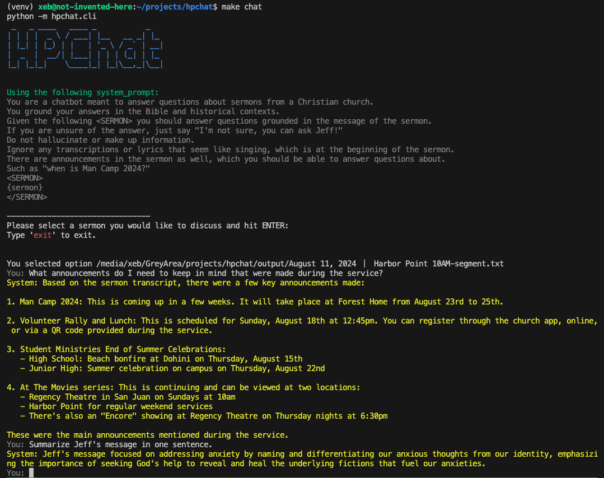

# hpchat
This is a demo of a custom, CLI based (for now) chatbot for [Harbor Point church](https://harborpoint.church). 

**NOTE:** I have no official affliation with Harbor Point and this repository is a **PROOF OF CONCEPT** not connected to the church directly or my employer. Don't get mad at me! I'm doing this because I love the church and it's members and find utility in using LLMs to understand God's word.

This demo includes utilities to download sermons, transcribe them, and then answer questions about the sermons.



# Setup
First, create a virtual environment
```
python3.12 -m venv venv
```
... and activate it.

```
. venv/bin/activate
```

Then install dependencies. I have a `Makefile` to make this easy (pun!)
```
make setup
```

Now you need to register any model keys. For gemini (current default), use:
```
llm keys set gemini
```
Which you can get at [aistudio.google.com](https://aistudio.google.com).


# Usage
I've included two sermons, so just use:
```
make chat
``` 
to get started.

# Adding Content
Go to YouTube, find one of Jeff's sermons. Run `dl.sh $URL $START_TIME $DURATION` -- I usually just say "2:00:00" for the duration.

Next, run `transcribe.sh` (or `make transcribe`) which will skip anything already transcribed (at least it should).

(I haven't fully tested the Python version yet, but will likely move it into the library... or not)
